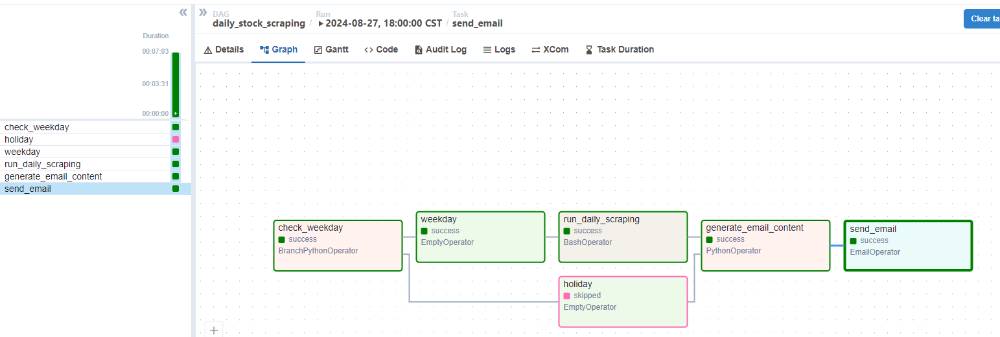
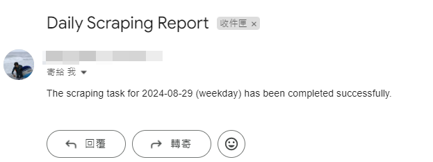

# Finance Project

> 利用fastapi與資料庫做串接


## 每日抓取股票資料

### 排程工具是Apache Airflow

>p.s. 要記得在airflow.cfg設定smtp帳號密碼(Google要先去開啟應用程式密碼)
>
>1. 負責執行排程工作的是airflow_daily_scraping.py
>2. 因為有環境問題所以要用腳本去呼叫虛擬環境daily_scraping.sh
>3. 利用xcom去儲存日期帶入.sh，參數利用sys傳入

daily_scriping.sh腳本如下

``` sh
#!/bin/bash
execution_date=$1 # get the dag execute datetime

PYTHON_PATH=/path/vitural_env_name/bin/python
echo "Python path is $PYTHON_PATH"

# execute scaping.py
$PYTHON_PATH /path/workdir/airflow_daily_scraping.py $execution_date
```

Airflow Dag腳本如下

``` python
#scraping every weekday on 18:00
#Notify me via email when completed
from airflow.decorators import dag
from airflow.operators.bash import BashOperator
from airflow.operators.python import BranchPythonOperator,PythonOperator
from airflow.operators.empty import EmptyOperator
from airflow.operators.email import EmailOperator
from datetime import datetime, timedelta
import pytz

default_dags = {
    'owner': "Marcus",
    "depend_on_past": False,
    "start_date": datetime(2024,8,28,18,tzinfo=pytz.timezone("Asia/Taipei")),
    "email": ['example@example.com'],
    "email_on_failure": False,
    "email_on_retry": False,
    'retries': 1,
    'retry_delay': timedelta(minutes=5)
}

def check_weekday():
        if datetime.today().weekday() < 5:
            return 'weekday'
        return 'holiday'

def generate_email_content(**context):
    execution_date = context['ds']
    if context['task_instance'].xcom_pull(task_ids='check_weekday') == 'weekday':
        return f'The scraping task for {execution_date} (weekday) has been completed successfully.'
    else:
        return f'It is a holiday on {execution_date}, so no scraping task was performed.'

@dag(
    dag_id='daily_stock_scraping', 
    description='Scraping task',
    default_args=default_dags, 
    schedule='0 18 * * *',
    catchup=False
    )
def scraping():

    check = BranchPythonOperator(
        task_id='check_weekday',
        python_callable=check_weekday,
    )
    holiday = EmptyOperator(
        task_id='holiday',
        trigger_rule='none_failed_or_skipped'
    )
    weekday = EmptyOperator(
        task_id='weekday',
        trigger_rule='none_failed_or_skipped'
    )

    run_scraping = BashOperator(
        task_id='run_daily_scraping',
        bash_command='sh /paht/script/daily_scriping.sh {{ ds }}',
        do_xcom_push=False,
        trigger_rule='none_failed_or_skipped'
    )

    generate_email = PythonOperator(
        task_id='generate_email_content',
        python_callable=generate_email_content,
        provide_context=True,
        trigger_rule='none_failed_or_skipped'
    )

    send_email = EmailOperator(
        task_id='send_email',
        to='example@example.com',
        subject='Daily Scraping Report',
        html_content="{{ task_instance.xcom_pull(task_ids='generate_email_content') }}",
        trigger_rule='none_failed_or_skipped'
    )

    check >> [weekday, holiday]
    weekday >> run_scraping >> generate_email >> send_email
    holiday >> generate_email >> send_email

scraping()
```




## 參考來源

[https://blog.csdn.net/Shepherdppz/article/details/117575286](https://blog.csdn.net/Shepherdppz/article/details/117575286)
